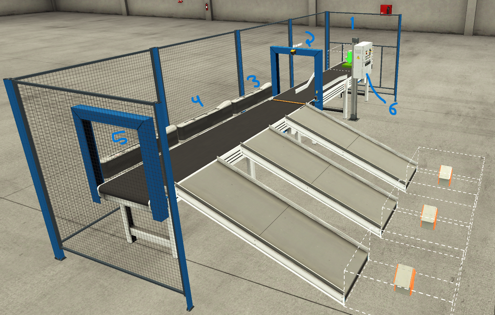
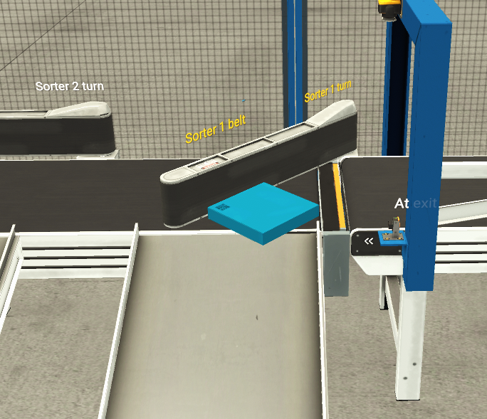
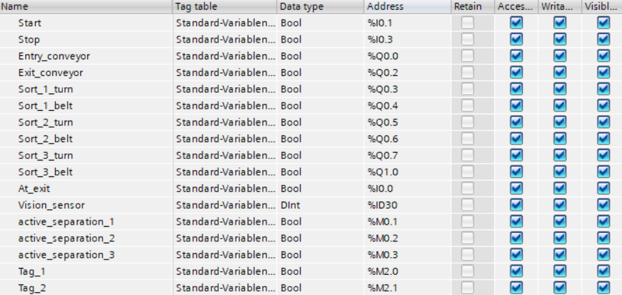

# Automation_sort_problem_clp
    Implementação de uma solução de automação com CLP, para a cena "sorting station" do ambiente de simulação FACTORY I/O.

## Descrição do problema
    O problema consiste em separar um conjunto de itens de acordo com seu formato. Existem itens de três formatos diferentes. Para automatizar o problema é utilizado uma esteira que desloca os itens de um ponto inicial até um sensor de visão, o sensor consegue distinguir o item baseado no seu formato e cor. Segue abaixo o esquema do processo.
    

 

    No ponto 1 na figura é possível visualizar o local onde os itens são inicialmente colocados. Os itens seguem até o ponto 2 através de uma esteira controlada por um motor. No ponto 2 é posicionado o sensor de visão que detecta o tipo de item que será separado. Uma segunda esteira move o item em linha reta e usando a informação obtida pelo sensor de visão, um dos três atuadores (3, 4 e 5 na figura) é ligado e desloca o item para uma posição final. O funcionamento do atuador é mostrado na figura abaixo.

    O atuador (Servo Motor) retorna a posição inicial no momento que um sensor de presença detecta que o item foi deslocado a uma das três posições. 
        Na cena existe ainda um painel, ponto 6 na figura, que possui botões para iniciar, resetar e parar a operação. Há também três contadores no painel que informam quanto itens de uma determinada cor foram separados.

O endereçamento dos componentes foi feito de acordo com a tabela abaixo:

#### O vídeo abaixo demonstra a lógica de funcionamento e o resultado da simulação.

[LINK PARA DEMOSTRAÇÃO](https://drive.google.com/file/d/1kZn53JAwL6aSD6cBiv5dzEaHPgr9IWWV/view?usp=sharing)